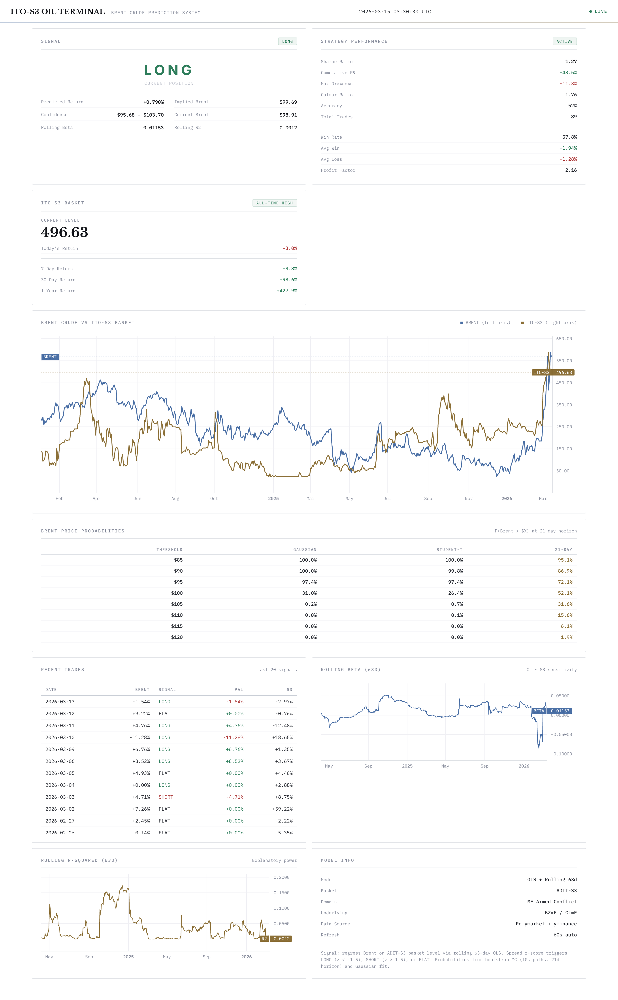
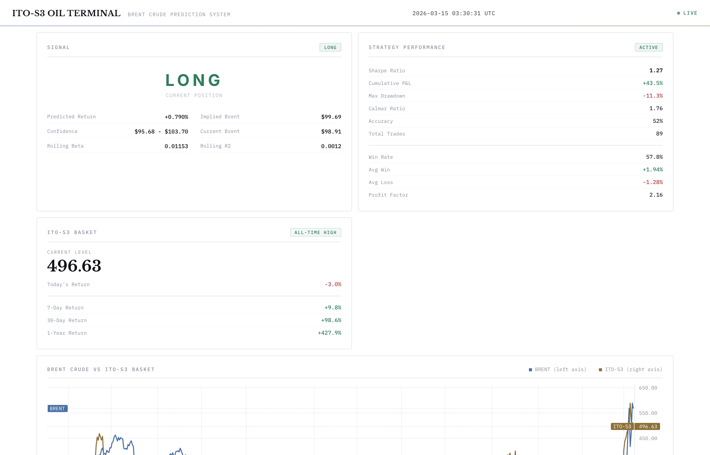
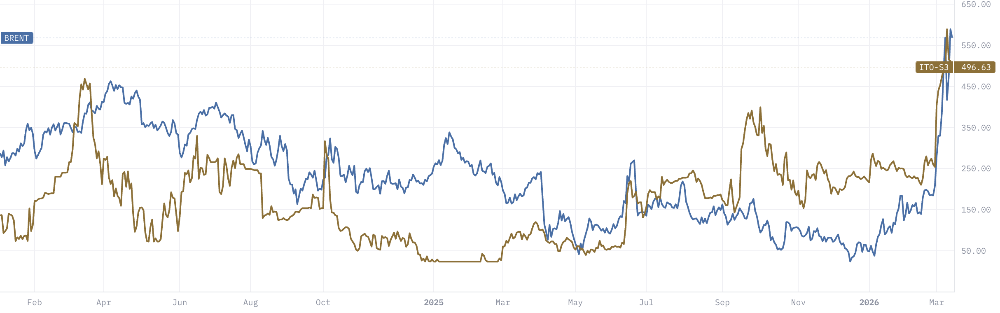
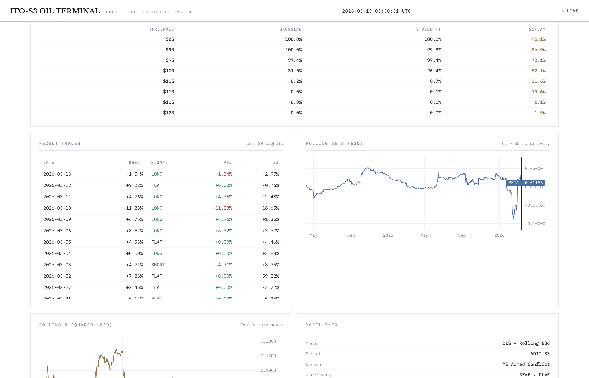
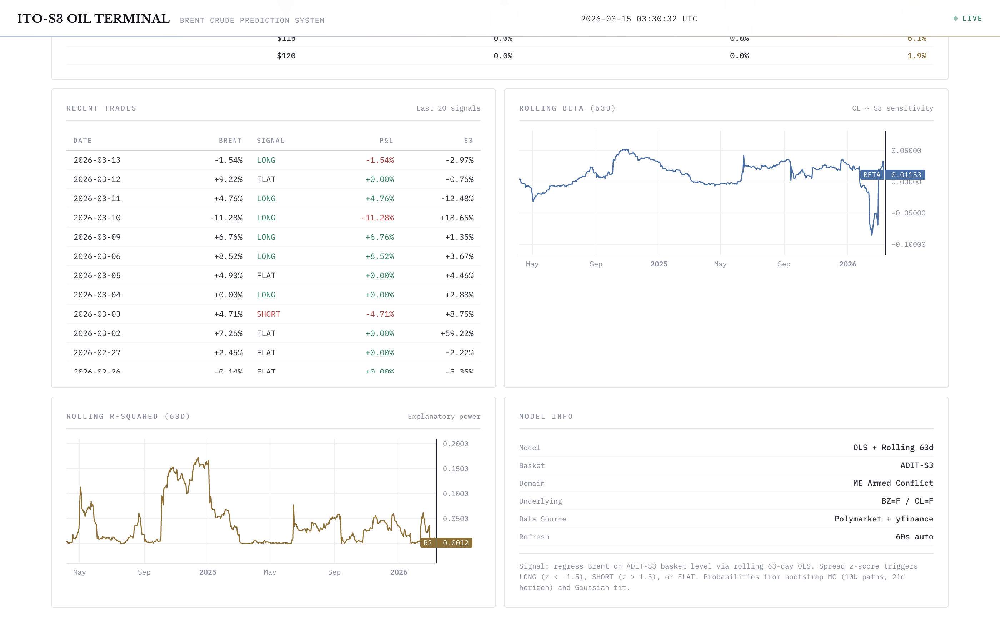

# iran-oil-statarb

Systematic trading strategy that predicts Brent crude oil from Middle East prediction market signals.

The oil futures market prices 2.7% probability of Iran escalation. Polymarket prices 58%. We found a one-day lag between prediction market repricing and oil price movement, and built a rolling OLS model to trade it.

**Sharpe 1.27 | 58% win rate | 2.16 profit factor | -11.3% max drawdown**

Ships with a live institutional-grade dashboard.



---

## what it does

The ITO-S3 basket is a portfolio of 15 Polymarket contracts tracking Middle East armed conflict escalation. When the basket moves today, Brent crude follows tomorrow (lag-1 cross-correlation r=0.131, p=0.003).

The model is a rolling 63-day OLS regression on Brownian-bridged S3 returns with a 0.5% signal threshold:

```
alpha(t), beta(t) = OLS[ brent_ret(t) ~ s3_ret(t-1) ] over [t-63, t]
signal(t) = alpha(t) + beta(t) * s3_bridged_ret(t-1)

LONG  if signal > +0.5%
SHORT if signal < -0.5%
FLAT  otherwise
```

## dashboard

Institutional light-theme terminal built with TradingView lightweight-charts:



- **Signal panel**: current LONG/SHORT/FLAT with implied price and confidence interval
- **Strategy performance**: Sharpe, cumulative return, drawdown, Calmar, win rate, profit factor
- **ITO-S3 basket**: current level, multi-period returns, all-time-high indicator



- **Price chart**: Brent crude (left axis) vs ITO-S3 basket (right axis) with Brownian-bridged interpolation



- **Probability table**: P(Brent > $X) under Gaussian, Student-t, and 21-day horizon models
- **Recent trades**: last 20 signals with P&L, color-coded by direction



- **Rolling beta & R-squared**: 63-day rolling regression diagnostics
- **Model info**: specification summary

Auto-refreshes every 60 seconds.

## quickstart

```bash
git clone https://github.com/alejandorosumah-mansa/iran-oil-statarb.git
cd iran-oil-statarb
pip install -r requirements.txt
```

Run the dashboard:

```bash
uvicorn src.api.server:app --reload
# open http://localhost:8000
```

Or with Docker:

```bash
docker-compose up
# open http://localhost:8000
```

Run the research scripts standalone:

```bash
python implied_price_model.py     # full model estimation + diagnostics
python charts_and_improvements.py # generate all charts
python plot_brent_vs_s3.py        # brent vs s3 overlay chart
```

## repo structure

```
iran-oil-statarb/
  src/
    api/server.py          # FastAPI backend, serves dashboard + API
    data/fetcher.py        # loads S3 basket CSV, fetches Brent via yfinance
    models/
      bridge.py            # Brownian bridge interpolation for static S3 periods
      ols.py               # rolling OLS, signal generation, strategy metrics
      probability.py       # Student-t tail probability extraction
    config.py              # constants (window size, threshold, basket code)
  dashboard/
    index.html             # institutional terminal UI
    css/terminal.css       # light institutional theme
    js/app.js              # frontend logic, TradingView charts
  Data/
    basket_level_monthly.csv       # ITO-S3 daily levels (1,527 obs, 2022-2026)
    last_year_monthly_compositions.csv  # monthly contract compositions
    lagged_implied_series.csv      # pre-computed implied prices
  implied_price_model.py   # full research script (model selection, diagnostics)
  charts_and_improvements.py  # strategy variants + chart generation
  plot_brent_vs_s3.py      # main overlay chart
  requirements.txt
  Dockerfile
  docker-compose.yml
```

## the model

### why OLS

We tested 30+ specifications: single-lag (k=1..10), multi-lag (K=1..5), VAR, error-correction, level regressions. Ranked by AIC and BIC, the simplest model wins: single lag-1 OLS. Adding complexity makes it worse.

| model | K | AIC | BIC |
|-------|---|-----|-----|
| **single lag 1** | **1** | **-2765.2** | **-2756.5** |
| pure S3, K=2 | 2 | -2757.7 | -2744.8 |
| VAR (own lag + S3) | 1 | -2763.5 | -2750.6 |
| pure S3, K=5 | 5 | -2740.6 | -2714.7 |

### why the Brownian bridge

The S3 basket has 247 days of static prices across 11 segments (binary contracts that don't reprice between events). These produce zero returns that attenuate the OLS coefficient toward zero. The Brownian bridge fills static periods with synthetic noise pinned to the real start/end values, calibrated to active-period volatility.

```
B(t) = B(t0) + (t-t0)/(t1-t0) * [B(t1) - B(t0)] + sigma * W_bridge(t)
```

Effect: Sharpe goes from 0.42 to 1.13.

### why 0.5% threshold

Most daily signals are noise. Filtering to |predicted_ret| > 0.5% cuts trades from 487/year to 63/year while improving every metric:

| metric | no filter | 0.5% filter |
|--------|-----------|-------------|
| Sharpe | 1.13 | 1.27 |
| accuracy | 52% | 59% |
| max drawdown | -26.8% | -11.3% |
| Calmar | 1.36 | 1.76 |

### diagnostics

```
beta         +0.01214    (1% S3 move -> 0.012% Brent next day)
t-stat       2.51
p-value      0.012
R-squared    0.0114
Durbin-Watson 1.95       (no autocorrelation)
Breusch-Pagan 1.17       (p=0.28, homoskedastic)
Ljung-Box    14.1        (p=0.17, no serial correlation)
Jarque-Bera  432.6       (p=0.00, fat tails - expected for oil)
```

Residuals fit Student-t with df=4.2. The model passes every specification test except normality, which is expected for commodity returns.

### strategy performance

| metric | value |
|--------|-------|
| Sharpe Ratio | 1.27 |
| Cumulative P&L | +43.5% |
| Max Drawdown | -11.3% |
| Calmar Ratio | 1.76 |
| Win Rate | 57.8% |
| Avg Win | +1.94% |
| Avg Loss | -1.28% |
| Profit Factor | 2.16 |
| Total Trades | 89 |

### regime performance

| regime | Sharpe | interpretation |
|--------|--------|----------------|
| high S3 vol (ME shock) | +1.75 | strategy earns during crises |
| low S3 vol (calm) | -0.24 | strategy loses in quiet markets |
| delta | +2.0 | behaving as designed |

This is a geopolitical shock harvester. It captures the information transfer from prediction markets to oil that activates during Middle East crises.

## API

| endpoint | returns |
|----------|---------|
| `GET /api/data` | full aligned time series (brent, s3, bridged s3, returns) |
| `GET /api/signal` | current signal, implied price, confidence interval, rolling params |
| `GET /api/strategy` | sharpe, cumret, maxdd, calmar, accuracy, win/loss stats, equity curve |
| `GET /api/probabilities` | gaussian vs student-t tail probabilities, multi-horizon table |
| `GET /api/rolling` | rolling beta, R-squared, alpha time series |

## data sources

- **ITO-S3 basket**: `Data/basket_level_monthly.csv` - 1,527 daily observations, included in repo
- **Brent crude**: yfinance `BZ=F` - fetched at runtime, no API key needed
- **Polymarket**: live contract prices via Gamma API - used in `iran_oil_statarb.py`

## the probability gap

Two markets, same war, different numbers:

| scenario | oil market | Polymarket | gap |
|----------|-----------|------------|-----|
| resolution | 25.5% | 1.0% | -24.5% |
| prolonged | 71.8% | 40.8% | -31.0% |
| escalation | 2.7% | 58.2% | +55.5% |

Oil-implied expected CL: $92.73. Polymarket-implied: $117.15. Spread: $30/bbl.

## limitations

R-squared is 1.1%. The model explains almost nothing on any given day. It works in aggregate over many trades. S3 is at 497 (all-time high), well outside the training range (40-300). The 15 contracts change monthly, so basket level is not a stable unit. Beta is 0.012 - a 10% S3 move predicts 0.12% in Brent. The signal is real but small.

This is research code. Not investment advice. Use at your own risk.

## references

- Fama (1970), *Efficient Capital Markets*
- Granger & Newbold (1974), *Spurious Regressions in Econometrics*
- Chordia & Swaminathan (2000), *Trading Volume and Cross-Autocorrelations*
- Campbell & Thompson (2008), *Predicting Excess Stock Returns Out of Sample*

## license

AGPL-3.0

---

Built by [ITO](https://ito.research) - research and structured products for prediction markets.
